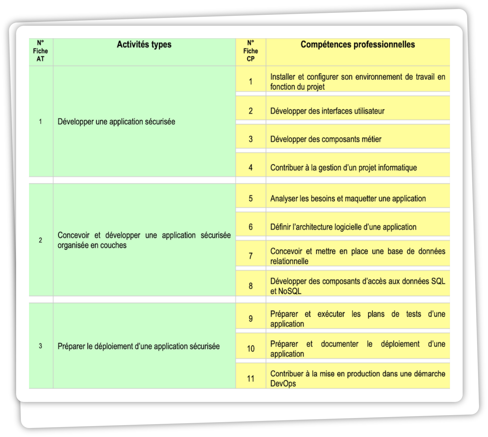

# Farfadet Joueur 

<!-- Main image  -->

## Sommaire

- [Tableau des compétences CDA](#tableau-des-compétences-cda)

## Navigation

- [Liste des entretiens clients](./doc/entretiens/liste_entretiens.md)
- [Slides du projet](./doc/slides/slides_presentation.md)

## Structure globale du projet

### [1. Introduction](./doc/dossier_pro/1_introduction.md)

### [2. Mon Parcours et Mes Compétences](./doc/dossier_pro/2_parcours_et_competences.md)
- [Mon Parcours](./doc/dossier_pro/2_parcours_et_competences.md#mon-parcours)
- [Tableau des Compétences](./doc/dossier_pro/2_parcours_et_competences.md#tableau-des-compétences)
- [Liste des Compétences](./doc/dossier_pro/2_parcours_et_competences.md#liste-des-compétences)

### [3. Organisation et Étude du Projet](./doc/dossier_pro/3_organisation_et_etude.md)
- [Contexte du Projet](./doc/dossier_pro/3_organisation_et_etude.md#contexte-du-projet)
- [Enjeux](./doc/dossier_pro/3_organisation_et_etude.md#enjeux)
- [Problématiques](./doc/dossier_pro/3_organisation_et_etude.md#problématiques)
- [Exigences Fonctionnelles](./doc/dossier_pro/3_organisation_et_etude.md#exigences-fonctionnelles)
- [Règles de Gestion](./doc/dossier_pro/3_organisation_et_etude.md#règles-de-gestion)
- [Composition des Équipes](./doc/dossier_pro/3_organisation_et_etude.md#composition-des-équipes)
- [Personas](./doc/dossier_pro/3_organisation_et_etude.md#personas)
- [Méthodologie Utilisée](./doc/dossier_pro/3_organisation_et_etude.md#méthodologie-utilisée)
- [Dictionnaire de Données](./doc/dossier_pro/3_organisation_et_etude.md#dictionnaire-de-données)
- [Sécurité](./doc/dossier_pro/3_organisation_et_etude.md#sécurité)

#### [3.1 Sécurité](./doc/dossier_pro/3_organisation_et_etude.md#sécurité)
- [Défense en Profondeur](./doc/dossier_pro/3_organisation_et_etude.md#défense-en-profondeur)
- [Réduction de la Surface d'Attaque](./doc/dossier_pro/3_organisation_et_etude.md#réduction-de-la-surface-dattaque)
- [Politique de Moindre Privilège](./doc/dossier_pro/3_organisation_et_etude.md#politique-de-moindre-privilège)
- [Conformité RGPD](./doc/dossier_pro/3_organisation_et_etude.md#conformité-rgpd)

### [4. Méthodologies de Modélisation](./doc/dossier_pro/4_methodologies_modelisation.md)

#### [4.1 Méthode Merise](./doc/dossier_pro/4_methodologies_modelisation.md#41-méthode-merise)
- [Définition](./doc/dossier_pro/4_methodologies_modelisation.md#définition)
- [MCD](./doc/dossier_pro/4_methodologies_modelisation.md#mcd)
- [MLD](./doc/dossier_pro/4_methodologies_modelisation.md#mld)
- [MPD](./doc/dossier_pro/4_methodologies_modelisation.md#mpd)

#### [4.2 UML](./doc/dossier_pro/4_methodologies_modelisation.md#42-uml)
- [Définition](./doc/dossier_pro/4_methodologies_modelisation.md#définition-1)
- [Diagramme de Cas d'Utilisation](./doc/dossier_pro/4_methodologies_modelisation.md#diagramme-de-cas-dutilisation)
- [Diagramme de Classe](./doc/dossier_pro/4_methodologies_modelisation.md#diagramme-de-classe)
- [Diagramme d'Activité](./doc/dossier_pro/4_methodologies_modelisation.md#diagramme-dactivité)
- [Diagrammes de Séquence](./doc/dossier_pro/4_methodologies_modelisation.md#diagrammes-de-séquence)

### [5. La Partie Développement](./doc/dossier_pro/5_partie_developpement.md)
- [Configuration de l'Environnement de Travail](./doc/dossier_pro/5_partie_developpement.md#configuration-de-lenvironnement-de-travail)
- [Mise en Place du Dépôt et des Branches](./doc/dossier_pro/5_partie_developpement.md#mise-en-place-du-dépôt-et-des-branches)
- [Guides de Contribution](./doc/dossier_pro/5_partie_developpement.md#guides-de-contribution)
- [Interfaces Utilisateur](./doc/dossier_pro/5_partie_developpement.md#interfaces-utilisateur)
- [Composants Métiers](./doc/dossier_pro/5_partie_developpement.md#composants-métiers)
- [Composants d'Accès aux Données](./doc/dossier_pro/5_partie_developpement.md#composants-daccès-aux-données)
- [Autres Composants](./doc/dossier_pro/5_partie_developpement.md#autres-composants)
- [Procédures de Sécurisation](./doc/dossier_pro/5_partie_developpement.md#procédures-de-sécurisation)
- [Plans de Test](./doc/dossier_pro/5_partie_developpement.md#plans-de-test)

### [6. Tests Appliqués](./doc/dossier_pro/6_tests_appliques.md)

#### [6.1 Introduction aux Tests](./doc/dossier_pro/6_tests_appliques.md#61-introduction-aux-tests)

#### [6.2 Tests Unitaires](./doc/dossier_pro/6_tests_appliques.md#62-tests-unitaires)

#### [6.3 Tests d'Intégration](./doc/dossier_pro/6_tests_appliques.md#63-tests-dintégration)

#### [6.4 Tests End-to-End](./doc/dossier_pro/6_tests_appliques.md#64-tests-end-to-end)

### [7. La Partie Déploiement](./doc/dossier_pro/7_partie_deploiement.md)
- [DevOps](./doc/dossier_pro/7_partie_deploiement.md#devops)
- [Procédures de Déploiement](./doc/dossier_pro/7_partie_deploiement.md#procédures-de-déploiement)
- [Maintenance Applicative](./doc/dossier_pro/7_partie_deploiement.md#maintenance-applicative)
- [Veille Technologique et Sécurité](./doc/dossier_pro/7_partie_deploiement.md#veille-technologique-et-sécurité)

#### [7.1 Sécurité en Production](./doc/dossier_pro/7_partie_deploiement.md#71-sécurité-en-production)
- [Vulnérabilités de Sécurité Rencontrées](./doc/dossier_pro/7_partie_deploiement.md#vulnérabilités-de-sécurité-rencontrées)
- [Failles Corrigées](./doc/dossier_pro/7_partie_deploiement.md#failles-corrigées)
- [Démo de l'Application](./doc/dossier_pro/7_partie_deploiement.md#démo-de-lapplication)

## Tableau des compétences CDA

