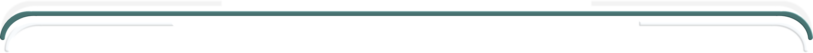
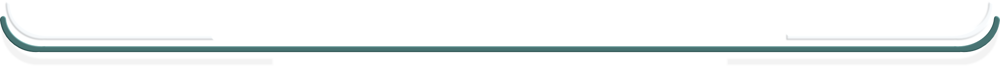

# Tools

## Sommaire

- [Borders ](#borders)
- [Line](#lines)
- [Buttons](#buttons)
- [Typo colors](#typo-colors)

---

## Borders

## Lines

## Buttons

---

## Typo Colors

<h1 style="color: #ab638c"> GET STARTED </h1>
<h2 style="color: #008080;">LINUX POSTEGRESQL </h2>

---

